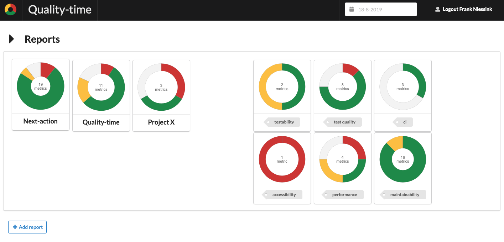
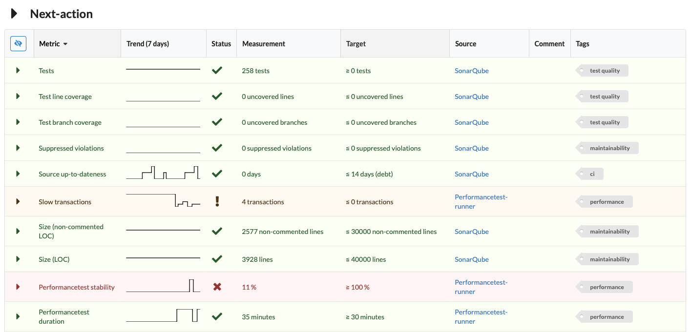
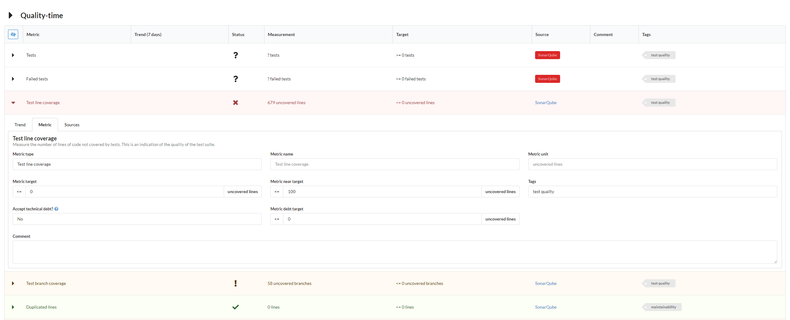
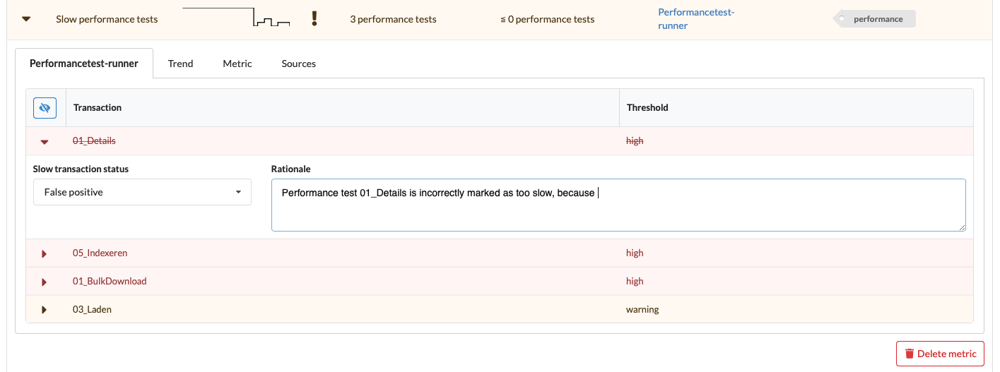

# Quality-time

[](https://travis-ci.org/ICTU/quality-time)
[](https://sonarcloud.io/dashboard?id=nl.ictu%3Aquality-time)
[](https://sonarcloud.io/dashboard?id=nl.ictu%3Aquality-time)
[](https://sonarcloud.io/dashboard?id=nl.ictu%3Aquality-time)
[](https://sonarcloud.io/dashboard?id=nl.ictu%3Aquality-time)

Quality report software for software development and maintenance. *Quality-time* continuously collects measurement data from sources such as Gitlab, SonarQube, Jira, Azure DevOps, and OWASP Dependency Check, to provide an overview of the quality of software products and projects. It does so by comparing measurement data with metric targets and informing development teams about the metrics that need improvement actions.

*Quality-time* is **Beta-stage** currently. We hope to release a version 1.0 before the end of 2019.

Technically, *Quality-time* consists of a Mongo database server, an LDAP server, a API-server written in Python, a metrics data collector also written in Python, and a React frontend. One of its purposes is to become a successor of [HQ](https://github.com/ICTU/quality-report).

Users can add and configure reports, metrics, and sources (such as SonarQube and Jira) in the frontend. The collector collects metrics data from the configured lmetric sources. It posts the measurements to the server which in turn stores them in the database. The frontend calls the server to get the reports and the measurements and presents them to the user.

## Table of contents

- [Screenshots](#screenshots)
- [Features](#features)
- [Trying it out](#trying-it-out)

Also see:

- [Deployment instructions](docs/DEPLOY.md)
- [User manual](docs/USAGE.md)
- [Developer manual](docs/DEVELOP.md)
- [Recent changes](docs/CHANGELOG.md)

## Screenshots

Some screenshots to wet your appetite.

### Projects dashboard

*Quality-time* shows a summary of the projects on its landing page:



### Metrics overview

For each metric, *Quality-time* displays the key data:



### Metric details

Users can expand the metrics to see and configure the metric details:



And to manage false positives:



## Features

Implemented features so far include:

- Robust data collection (the collector should never fail, even in the face of misconfigured or unavailable sources).
- Measurement history is kept in a database, allowing for time travel.
- Easy report configuration via the UI.
- Multiple reports in one *Quality-time* instance.
- The possibility to use HQ as a metric source.
- Simple/naive LDAP-integration.
- Generic false-positive management.
- Metric tags can be used to summarize metrics with the same tag across subjects, e.g. to summarize all security metrics.

For more plans, see the [issue tracker](https://github.com/ICTU/quality-time/issues).

## Trying it out

*Quality-time* requires Docker and Docker-compose.

Clone this repository:

```console
git clone git@github.com:ICTU/quality-time.git
```

Build the containers:

```console
docker-compose build
```

Start the containers:

```console
docker-compose up
```

The frontend is served at [http://localhost:5000](http://localhost:5000).

By default, there is one user defined. Use username `admin` and password `admin` to log in.
