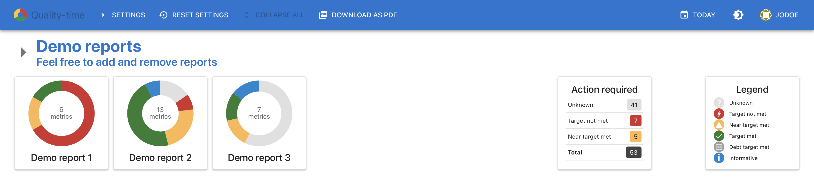

# *Quality-time*: software quality monitoring for teams and projects

*Quality-time* is an automated quality system for software development and maintenance. *Quality-time* collects measurement data from sources such as Gitlab, SonarQube, Jira, Azure DevOps, and OWASP Dependency Check, to provide an overview of the quality of software products and projects. It does so by comparing measurement data with metric targets and informing development teams about the metrics that need improvement actions.

See the *Quality-time* [documentation](https://quality-time.readthedocs.io/en/latest) for more screenshots, features, user manual, deployment instructions, and more.

