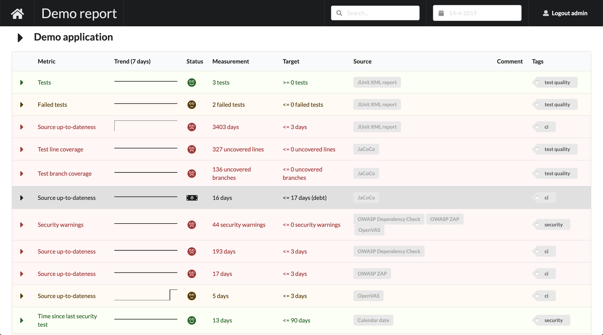
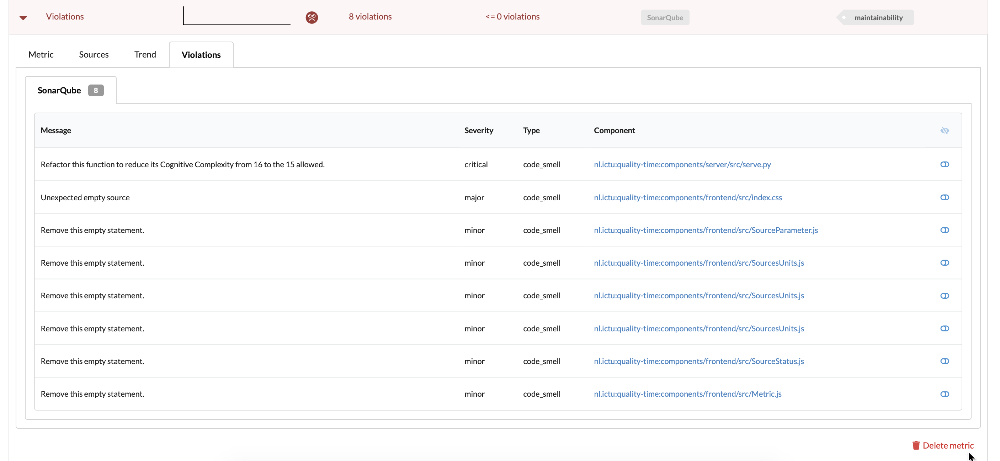

# Quality-time

Quality report software for software development and maintenance. **Alpha-stage** currently. At the moment, *Quality-time* consists of a Mongo database server, a LDAP server, an API-server, a metrics data collector, and a React frontend. Its main purpose is to experiment with features for a successor of [HQ](https://github.com/ICTU/quality-report).

The collector collects metrics data from metric sources such as SonarQube and Jira. It posts the measurements to the server which in turn stores them in the database. The frontend calls the server to get the reports and the measurements and presents it to the user.

## Table of contents

- [Screenshots](#screenshots)
- [Features](#features)
- [Installation](#installation)
- [Usage](#usage)
- [Test](#test)
- [Recent changes](#recent-changes)

## Screenshots

Some preliminary screenshots to wet your appetite.

### Projects dashboard

*Quality-time* shows a summary of the projects on its landing page:


### Metrics overview

For each metric, *Quality-time* displays the key data:



### Metric details

Users can expand the metrics to see and configure the metric details and manage false positives:



## Features

Implemented features so far include:

- Simpler and more robust scheduled data collection.
- History in a database, allowing for time travel.
- Easy report configuration via the UI.
- Multiple reports in one Quality-time instance.
- The possibility to use HQ as a metric source.
- Simple/naive LDAP-integration.
- Generic false-positive management.

For more plans, see the issue tracker.

## Installation

*Quality-time* requires Docker and Docker-compose.

There's no release yet, so you have to run from sources for the time being.

Clone this repository:

```console
git clone git@github.com:ICTU/quality-time.git
```

Build the containers:

```console
docker-compose build
```

## Usage

Start the containers:

```console
docker-compose up
```

The frontend is served at [http://localhost:5000](http://localhost:5000).

By default, there is one user defined. Use username `admin` and password `admin` to log in.

## Develop

Follow these instructions to run the software in hot-reload mode for easy development. Prerequisites are Python 3.7 and a recent version of Node/npm.

Clone this repository:

```console
git clone git@github.com:ICTU/quality-time.git
```

Open four terminals. In the first one, run the standard containers with docker-compose:

```console
docker-compose up database ldap mongo-express
```

In the second one, run the server:

```console
cd components/server
python3 -m venv .venv
. .venv/bin/activate
pip install -r requirements.txt -r requirements-dev.txt
python setup.py develop
quality-time-server
```

In the third one, run the collector:

```console
cd components/collector
python3 -m venv .venv
. .venv/bin/activate
pip install -r requirements.txt -r requirements-dev.txt
python setup.py develop
quality-time-collector
```

In the fourth one, run the frontend:

```console
npm run install
npm run start
```

The frontend is served at [http://localhost:3000](http://localhost:3000).

## Test

To run the unit tests and measure unit test coverage change directory into the component folders, e.g.:

```console
cd compontents/server
ci/unittest.sh
```

To run mypy and pylint:

```console
ci/quality.sh
```

To run the frontend tests (which are unfortunately mostly missing at the moment):

```console
cd compontents/frontend
npm run test
```

## Recent changes

The [change log](https://github.com/ICTU/quality-time/blob/master/CHANGELOG.md) will not be maintained until after the first release.
