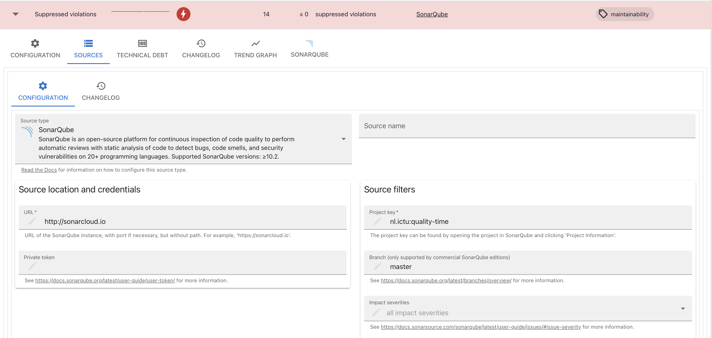
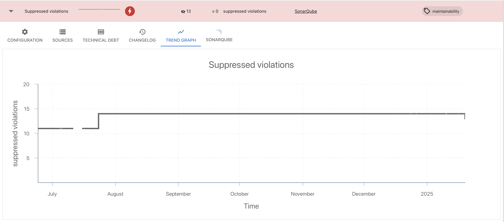
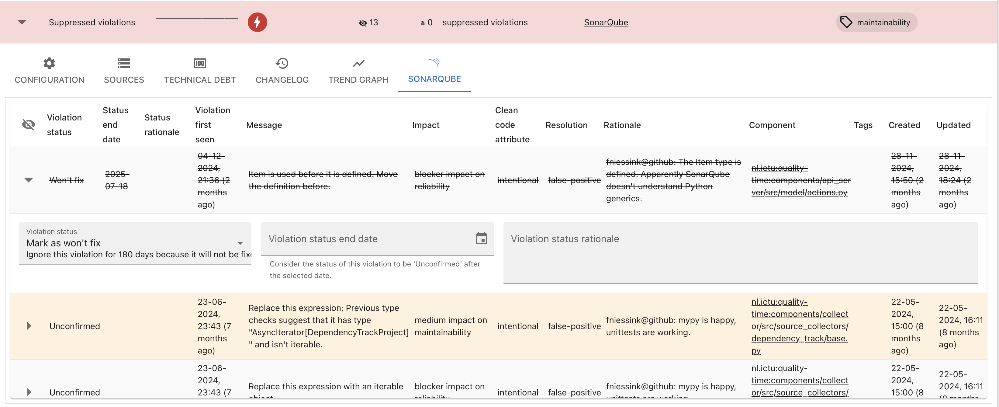

# Quality-time

[](https://sonarcloud.io/dashboard?id=nl.ictu%3Aquality-time)
[](https://sonarcloud.io/dashboard?id=nl.ictu%3Aquality-time)
[](https://sonarcloud.io/dashboard?id=nl.ictu%3Aquality-time)
[](https://sonarcloud.io/dashboard?id=nl.ictu%3Aquality-time)
[](https://bettercodehub.com/)

*Quality-time* is an automated quality system for software development and maintenance. *Quality-time* collects measurement data from sources such as Gitlab, SonarQube, Jira, Azure DevOps, and OWASP Dependency Check, to provide an overview of the quality of software products and projects. It does so by comparing measurement data with metric targets and informing development teams about the metrics that need improvement actions.

Technically, *Quality-time* consists of a React frontend, a Mongo database server, and three backend components written in Python: an API-server, a worker component to collect measurement data from the sources, and a worker component to send notifications. 

Users can add and configure reports, metrics, and sources (such as SonarQube and Jira) in the frontend. The collector collects metrics data from the configured metric sources. It posts the measurements to the server which in turn stores them in the database. The frontend calls the server to get the reports and the measurements and presents them to the user.

## Table of contents

- [Screenshots](#screenshots)
- [Features](#features)
- [Trying it out](#trying-it-out)

Also see:

- [User manual](https://quality-time.readthedocs.io/en/latest/usage.html)
- [Supported metrics and sources](https://quality-time.readthedocs.io/en/latest/metrics_and_sources.html)
- [Deployment instructions](https://quality-time.readthedocs.io/en/latest/deployment.html)
- [Developer manual](https://quality-time.readthedocs.io/en/latest/development.html)
- [Change log](https://quality-time.readthedocs.io/en/latest/changelog.html)

## Screenshots

Some screenshots to wet your appetite.

### Projects dashboard

*Quality-time* shows a summary of the projects on its landing page:


### Metrics overview

For each metric, *Quality-time* displays the key data:


### Metric details

Users can expand the metrics to see and configure the metric details:



Keep track of trends:



And manage false positives:



## Features

Implemented features include:

- Robust data collection (the collector should never fail, even in the face of misconfigured or unavailable sources).
- Measurement history is kept in a database, allowing for time travel.
- Easy report configuration via the UI.
- Multiple reports in one *Quality-time* instance.
- LDAP-integration.
- Generic false-positive management.
- Metric tags can be used to summarize metrics with the same tag across subjects, e.g. to summarize all security metrics.
- Export of reports to PDF, both via the UI as well as via the API.
- Notifications of events, such as metrics turning red, to Microsoft Teams.
- Side-by-side comparison of measurements at different points in time.

For more plans, see the [issue tracker](https://github.com/ICTU/quality-time/issues).

## Trying it out

*Quality-time* requires Docker and Docker-compose.

Clone this repository:

```console
git clone https://github.com/ICTU/quality-time.git
```

Build the containers:

```console
docker-compose build
```

Start the containers:

```console
docker-compose up
```

The frontend is served at [http://localhost](http://localhost). Use username `admin` and password `admin` to log in.
