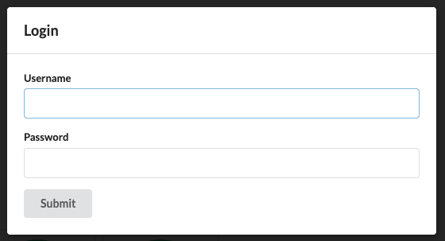
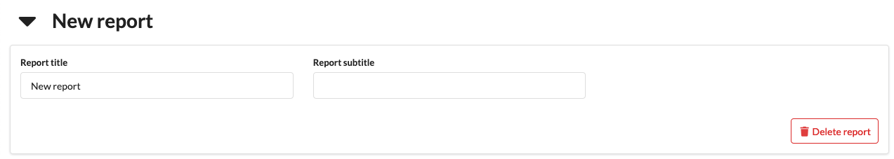

# *Quality-time* user manual

## Logging in and out

Quality reports can be viewed without logging in, but to edit reports and metrics you need to be logged in. Click the "Login" button in the menu bar:

Enter your LDAP-credentials in the dialog:

> Currently, you can only use your "Canonical LDAP name" as username and not your LDAP userid. Please contact your system administrator if you don't know your canonical LDAP name.

After hitting "Submit" you should be logged in. The menubar shows your username.

Clicking "Logout" logs you out from *Quality-time*.

## Configuring quality reports

Each *Quality-time* instance can serve multiple quality reports. A quality report consists of one or more subjects - things such as software products, projects, and processes - that you want to measure the quality of. Each subject has one or more metrics that tell you something about the quality of the subject. For example, the number of failing test cases of an application or the number of ready user story points for a Scrumteam. To collect the measurement data, each metric has one ore more sources that *Quality-time* will use to measure the metric.

> You need to be logged in to be able to edit quality reports.

### Adding reports

To add a new report, be sure to be logged in and click the "Add report" button on the home page. This will create a new empty report. Click the report card in the dashboard to navigate to it.

### Editing reports

To change the title or subtitle of a report, expand the report header and simply enter a new title and/or subtitle in their respective fields.

### Deleting reports

To delete a report expand the report header and click the "Delete report" button. The report and all its subjects is deleted.

> Be careful, there's no way to undo your action via the user interface.

### Adding subjects

Each quality report consists of "subjects". Subjects are the things being measured by *Quality-time*. A subject can be a software product or component, a software process, or whatever you like. To add a new subject, be sure you are logged in and are on a report page. Click the "Add subject" button to add a new subject. The subject is added to the report dashboard.

### Editing subjects

To change the subject type and name expand the subject header if it's not already expanded. The subject type can be changed by means of the "Subject type" dropdown.

> Currently, changing the type of the subject does not affect what you can do with the subject.

To change the name of the subject, simply type the new name in the "Subject name" field and hit enter.

### Deleting subjects

To delete a subject expand the subject header and click the "Delete subject" button. The subject and all its metrics is deleted.

> Be careful, there's no way to undo your action via the user interface.

### Adding metrics

### Editing metrics

### Deleting metrics

### Adding sources

### Editing sources

### Deleting sources
