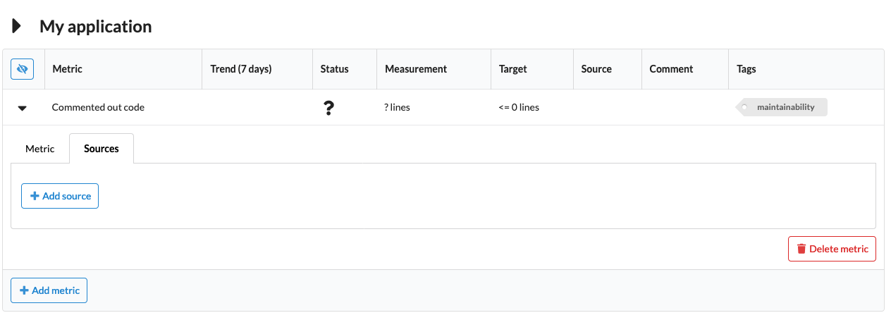

# *Quality-time* user manual

## Table of contents

- [Logging in and out](#logging-in-and-out)
- [Configuring quality reports](#configuring-quality-reports)

## Logging in and out

Quality reports can be viewed without logging in, but to edit reports and metrics you need to be logged in. Click the "Login" button in the menu bar:

Enter your LDAP-credentials in the dialog:

> Currently, you can only use your "Canonical LDAP name" as username and not your LDAP userid. Please contact your system administrator if you don't know your canonical LDAP name.

After hitting "Submit" you should be logged in. The menubar shows your username.

Clicking "Logout" logs you out from *Quality-time*.

## Configuring quality reports

Each *Quality-time* instance can serve multiple quality reports. A quality report consists of one or more subjects - things such as software products, projects, and processes - that you want to measure the quality of. Each subject has one or more metrics that tell you something about the quality of the subject. For example, the number of failing test cases of an application or the number of ready user story points for a Scrumteam. To collect the measurement data, each metric has one ore more sources that *Quality-time* will use to measure the metric.

> You need to be logged in to be able to edit quality reports.

### Adding reports

To add a new report, be sure to be logged in and click the "Add report" button on the home page. This will create a new empty report. Click the report card in the dashboard to navigate to it.

### Editing reports

To change the title or subtitle of a report, expand the report header and simply enter a new title and/or subtitle in their respective fields.

### Deleting reports

To delete a report expand the report header and click the "Delete report" button. The report and all its subjects is deleted.

> Be careful, there's no way to undo your action via the user interface.

### Adding subjects

Each quality report consists of "subjects". Subjects are the things being measured by *Quality-time*. A subject can be a software product or component, a software process, or whatever you like. To add a new subject, be sure you are logged in and are on a report page. Click the "Add subject" button to add a new subject. The subject is added to the report dashboard.

### Editing subjects

To change the subject type and name expand the subject header if it's not already expanded. The subject type can be changed by means of the "Subject type" dropdown.

> Currently, changing the type of the subject does not affect what you can do with the subject.

To change the name of the subject, simply type the new name in the "Subject name" field and hit enter.

### Deleting subjects

To delete a subject expand the subject header and click the "Delete subject" button. The subject and all its metrics is deleted.

> Be careful, there's no way to undo your action via the user interface.

### Adding metrics

To add a metric to a subject, hit the "Add metric" button.

*Quality-time* adds a metric to the report that you can next configure. It's immediately displayed in the metric table (and in the report dashboard) as white and with a question mark because *Quality-time* has no data on this metric yet.

### Editing metrics

After you've added a metric, the metric is visible in the subject's metric table. You can change the metric configuration in the metric tab. The first parameter is the metric type. By default the name of the metric is equal to its type, in the example below "Commented out code", but you can change the metric name using the "Metric name" field. The same goes for the default metric unit that you can rename using the "Metric unit" field.

The metric target determines at what value a measurement is below or above target. In the example below only measurement values of 0 are on target. The *near target* determines when the measurement value is sufficiently close to the target to no longer require immediate action.

Each metric type has default tags, but you can also add your own tags. For each tag, the report dashboard at the top of the page shows a summary of the metrics with that tag.

If a metric doesn't meet the target value, but your team isn't able to fix the situation in the short run, you can accept the deviation as *technical debt*. Set the "Accept technical debt?" field to "Yes" and enter the value you're accepting for the time being in the "Metric debt target" field. The rationale for accepting techn§ical debt can be entered in the "Comment" field.

### Deleting metrics

To delete a metric expand the metric in the metric table, select the "Metric" tab and click the "Delete metric" button. The metric and its sources are deleted.

> Be careful, there's no way to undo your action via the user interface.

### Adding sources

To add a source to a metric, expand the metric in the metric table and then click the "Sources" tab. In the "Sources" tab, click the "Add source" button. This adds one of the sources that can support the metric type.

If you add multiple sources for one metric the measurement values of each source are combined to get one measurement value for the metric. Usually this means adding up the values, but for some metrics this doesn't make sense and the maximum value of the sources is used as the metric value.

### Editing sources

After you've added a source, you can change the source type using the "Source type" dropdown menu. The available source types depend on the metric type. E.g. SonarQube supports the commented out code metric type, but GitLab does not so GitLab is not shown.

By default, the name of the source equals the source type but this can overridden using the "Source name" field.

The parameters that sources need differ per source type. Most sources need a URL, and optionally take either a username and password or a token so that *Quality-time* can access the source. If a parameter is required, this is indicated with a red outline as shown below.

### Deleting sources

To delete a metric's source, expand the metric in the metric table, select the "Sources" tab and click the "Delete source" button. The source is deleted and no longer used to measure the metric.

> Be careful, there's no way to undo your action via the user interface.
