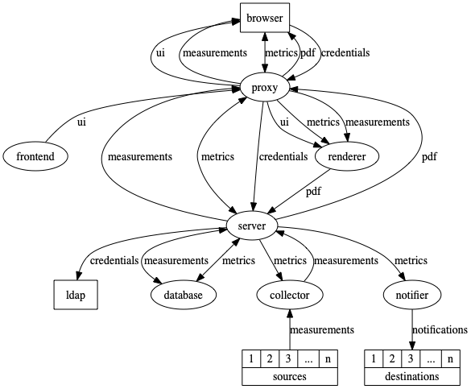

# Developing *Quality-time*

## Table of contents

- [Develop](#develop)
- [Test](#test)
- [Release](#release)
- [Maintain](#maintain)
- [Software components](#software-components)
- [Adding metrics and sources](#adding-metrics-and-sources)

## Develop

### Running *Quality-time* locally

Follow these instructions to run the software in hot-reload mode for easy development.

#### Install prerequisites

Prerequisites are Docker, Git, Python 3.9, a recent version of Node.js (we test with the Long Term Support version of Node).

Clone this repository:

```console
git clone git@github.com:ICTU/quality-time.git
```

#### Start standard components

Open a terminal and start the standard containers with docker-compose:

```console
docker-compose up database ldap phpldapadmin mongo-express testdata
```

Mongo-express is served at [http://localhost:8081](http://localhost:8081) and can be used to inspect and edit the database contents.

PHP-LDAP-admin is served at [http://localhost:3890](http://localhost:3890) and can be used to inspect and edit the LDAP database. Click login, check the "Anonymous" box and click "Authenticate" to login.

By default, there are three users defined in the LDAP database:

- User `admin` has password `admin`.
- User `Jane Doe` has user id `jadoe` and password `secret`.
- User `John Doe` has user id `jodoe` and password `secret`.

#### Start the server

Open another terminal and run the server:

```console
cd components/server
python3 -m venv venv
. venv/bin/activate  # on Windows: venv\Scripts\activate
pip install -r requirements.txt -r requirements-dev.txt
python src/quality_time_server.py
```

The API of the server is served at [http://localhost:5001](http://localhost:5001), e.g. access [http://localhost:5001/api/v3/reports](http://localhost:5001/api/v3/reports) to get the available reports combined with their recent measurements.

#### Start the collector

Open another terminal and run the collector:

```console
cd components/collector
python3 -m venv venv
. venv/bin/activate  # on Windows: venv\Scripts\activate
pip install -r requirements.txt -r requirements-dev.txt
python src/quality_time_collector.py
```

#### Start the frontend

Open another terminal and run the frontend:

```console
cd components/frontend
npm install
npm run start
```

The frontend is served at [http://localhost:3000](http://localhost:3000).

#### Start the notifier

Optionally, open yet another terminal and run the notifier:

```console
cd components/notifier
python3 -m venv venv
. venv/bin/activate  # on Windows: venv\Scripts\activate
pip install -r requirements.txt -r requirements-dev.txt
python src/quality_time_notifier.py
```

### Coding style

This section contains some notes on coding style used in this project. It's far from complete, however.

#### Python

Most of the coding standard are enforced by the [quality checks](#quality-checks).

To enable autoformatting of Python code using black, a git pre-commit hook is provided at `git-hooks/pre-commit`. To use it and automatically format all changed Python files on committing, copy this script into your local `.git/hooks` folder of this repo.

Methods that can or should be overridden in subclasses have a name with one leading underscore, e.g. `_api_url(self) -> URL`. Methods that should only be used by a class instance itself have a name with two leading underscores, e.g. `__fields(self) -> List[str]`.

Production code and unit tests are organized in parallel hierarchies. Each Python component has a `src` with the production code and a `tests` folder with the unit tests. The folder layout of the `tests` follows the layout of the `src` hierarchy.

#### JavaScript

Functional React components are preferred over class-based components.

Production code and unit tests are organized together in one `src` folder hierarchy.

## Test

### Unit tests

To run the unit tests and measure unit test coverage of the backend components:

```console
cd components/server  # or components/collector, or components/notifier
python3 -m venv venv
. venv/bin/activate  # on Windows: venv\Scripts\activate
pip install -r requirements.txt -r requirements-dev.txt
ci/unittest.sh
```

To run the frontend unit tests:

```console
cd compontents/frontend
npm install
npm run test
```

### Quality checks

To run mypy, pylint, and some other security and quality checks on the backend components:

```console
cd components/server  # or components/collector, or components/notifier
ci/quality.sh
```

### Feature tests

The feature tests currently test all features through the server API. They touch all components except the frontend, the collector, and the notifier. To run the feature tests, invoke this script, it will start all the necessary components, run the tests, and gather coverage information:

```console
tests/feature_tests/ci/test.sh
```

The `test.sh` shell script will start a server under coverage and then run the [feature tests](../tests/feature_tests).

### Application tests

The application tests in theory test all components through the frontend, but unfortunately the number of tests is still very small. To run the application tests, start all components and then start the tests:

```console
docker-compose up -d
docker run -it -w `pwd` -v `pwd`:`pwd` --network=container:qualitytime_www_1 circleci/python:3.9.5-browsers tests/application_tests/ci/test.sh
```

## Release

See [release README](../release/README.md).

## Maintain

Keeping dependencies up-to-date is an important aspect of software maintenance. Python (pip) and JavaScript (npm) dependencies are kept up-to-date via the [Dependabot GitHub action](../.github/dependabot.yml). 

Base images used in the Docker containers, and additionally installed software, need to be upgraded by hand from time to time. These are:

- [Database](../components/database/Dockerfile): the MongoDB base image.
- [Collector](../components/collector/Dockerfile): the Python base image.
- [Frontend](../components/frontend/Dockerfile): the Node base image, the curl version, and the serve version.
- [LDAP](../components/ldap/Dockerfile): the OpenLDAP base image.
- [Notifier](../components/notifier/Dockerfile): the Python base image.
- [Proxy](../components/proxy/Dockerfile): the Caddy base image.
- [Renderer](../components/renderer/Dockerfile): the url-to-pdf-api image.
- [Server](../components/server/Dockerfile): the Python base image.
- [Testdata](../components/testdata/Dockerfile): the Python base image.

## Software components



*Quality-time* consists of seven components. Three standard components:

- A proxy (we use the [ICTU variant of Caddy](https://github.com/ICTU/caddy), but this can be replaced by another proxy if so desired) routing traffic from and to the user's browser,
- A database ([Mongo](https://www.mongodb.com)) for storing reports and measurements,
- A renderer (we use the [ICTU variant of url-to-pdf-api](https://github.com/ICTU/url-to-pdf-api) to export reports to PDF,

And four bespoke components:

- A [frontend](../components/frontend/README.md) serving the React UI,
- A [server](../components/server/README.md) serving the API,
- A [collector](../components/collector/README.md) to collect the measurements from the sources.
- A [notifier](../components/notifier/README.md) to notify users about events such as metrics turning red.

In addition, unless forward authentication is used, an LDAP server is expected to be available to authenticate users.

For testing purposes there are also [test data](../components/testdata/README.md) and an [LDAP-server](../components/ldap/README.md).

## Adding metrics and sources

*Quality-time* has been designed with the goal of making it easy to add new metrics and sources. The [data model](../components/server/src/data/datamodel.json) specifies all the details about metrics and sources, like the scale and unit of metrics, and the parameters needed for sources. In general, besides changing the data model, no coding is needed to add a new metric, besides augmenting the [collector](../components/collector/README.md) component to parse the source data and optionally adding a logo to the [frontend](../components/frontend/README.md) component.

### Adding new metrics

To add a new metric you need to add a specification of the metric to the [data model](../components/server/src/data/datamodel.json). See the documentation of the [server](../components/server/README.md) component for a description of the data model. Be sure to run the unit tests of the server component after adding a metric to the data model, they check the integrity of the data model. Other than changing the data model, no code changes are needed to support new metrics.

### Adding new sources

#### Adding the new source to the data model

To add a new source you need to add a specification of the source to the [data model](../components/server/src/data/datamodel.json). See the documentation of the [server](../components/server/README.md) component for a description of the data model. Be sure to run the unit tests of the server component after adding a source to the data model, they check the integrity of the data model.

Suppose we want to add [cloc](https://github.com/AlDanial/cloc) as source for the LOC (size) metric and read the size of source code from the JSON file that cloc can produce. We would add a `cloc` source to the data model (see the [data model](../components/server/src/data/datamodel.json) for the complete specification):

```json
{
    "sources": {
        ...
        "cloc": {
            "name": "cloc",
            "description": "cloc is an open-source tool for counting blank lines, comment lines, and physical lines of source code in many programming languages",
            "url": "https://github.com/AlDanial/cloc",
            "parameters": {
                "url": {
                    "name": "URL to a cloc report in JSON format or to a zip with cloc reports in JSON format",
                    "short_name": "URL",
                    "type": "url",
                    "mandatory": true,
                    "default_value": "",
                    "metrics": [
                        "loc"
                    ]
                },
                <...more parameters>
            }
        }
    }
}
```

#### Adding the new source to the collector

To specify how *Quality-time* can collect data from the source, a new subclass of [`SourceCollector`](../components/collector/src/base_collectors/source_collector.py) needs to be created.

Add a new Python package to the [`source_collectors` folder](../components/collector/src/source_collectors) with the same name as the source type in the data model. For example, if the new source type is `cloc`, the folder name of the collectors is also `cloc`. Next, create a module for each metric that the new source supports. For example, if the new source `cloc` supports the metric LOC (size) and the metric source-up-to-dateness, you would create two modules, each containing a subclass of `SourceCollector`: a `ClocLOC` class in `cloc/loc.py` and a `ClocSourceUpToDateness` class if `cloc/source_up_to_dateness.py`. If code can be shared between these classes, add a `cloc/base.py` file with a `ClocBaseClass`.

To reduce duplication, `SourceCollector` has several abstract subclasses. The class hierarchy is currently as follows:

- `SourceCollector`
  - `UnmergedBranchesSourceCollector`: for sources that collect data for the number of unmerged branches metric
  - `JenkinsPluginCollector`: for sources that collect their data from Jenkins plugins
  - `SourceUpToDatenessCollector`: for sources that support the source-up-to-dateness metric
    - `JenkinsPluginSourceUpToDatenessCollector`: for getting the source-up-to-dateness from Jenkins plugins
  - `LocalSourceCollector`: for sources that are local to the collector like fixed numbers and date/times
  - `FileSourceCollector`: for sources that parse files
    - `CSVFileSourceCollector`: for sources that parse CSV files
    - `HTMLFileSourceCollector`: for sources that parse HTML files
    - `JSONFileSourceCollector`: for sources that parse JSON files
    - `XMLFileSourceCollector`: for sources that parse XML files

To support [cloc](https://github.com/AlDanial/cloc) as source for the LOC (size) metric we need to read the size of source code from the JSON file that cloc can produce. We add a `cloc/loc.py` file and in `loc.py` we create a `ClocLOC` class with `JSONFileSourceCollector` as super class. The only method that needs to be implemented is `_parse_source_responses()` to get the amount of lines from the cloc JSON file. This could be as simple as:

```python
"""cloc lines of code collector."""

from base_collectors import JSONFileSourceCollector
from source_model import SourceMeasurement, SourceResponses


class ClocLOC(JSONFileSourceCollector):
    """cloc collector for size/lines of code."""

    async def _parse_source_responses(self, responses: SourceResponses) -> SourceMeasurement:
        loc = 0
        for response in responses:
            for key, value in (await response.json()).items():
                if key not in ("header", "SUM"):
                    loc += value["code"]
        return SourceMeasurement(value=str(loc))
```

Most collector classes are bit more complex than that, because to retrieve the data they have to deal with API's and while parsing the data they have to take parameters into account. See the collector source code for more examples.

##### Writing and running unit tests

To test the `ClocLOC` collector class, we add unit tests to the [collector tests package](../components/collector/tests), for example:

```python
"""Unit tests for the cloc source."""

from ...source_collector_test_case import SourceCollectorTestCase


class ClocLOCTest(SourceCollectorTestCase):
    """Unit tests for the cloc loc collector."""
    
    SOURCE_TYPE = "cloc"
    METRIC_TYPE = "loc"

    async def test_loc(self):
        """Test that the number of lines is returned."""
        cloc_json = {
            "header": {}, "SUM": {},  # header and SUM are not used
            "Python": {"nFiles": 1, "blank": 5, "comment": 10, "code": 60},
            "JavaScript": {"nFiles": 1, "blank": 2, "comment": 0, "code": 30}}
        response = await self.collect(get_request_json_return_value=cloc_json)
        self.assert_measurement(response, value="90", total="100")
```

Note that the `ClocTest` class is a subclass of `SourceCollectorTestCase` which creates a source and metric for us, specified using `SOURCE_TYPE` and `METRIC_TYPE`, and provides us with helper methods to make it easier to mock sources (`SourceCollectorTestCase.collect()`) and test results (`SourceCollectorTestCase.assert_measurement()`).

In the case of collectors that use files as source, also add an example file to the [test data component](../components/testdata/README.md).

To run the unit tests:

```console
cd components/collector
ci/unittest.sh
```

You should get 100% line and branch coverage.

##### Running quality checks

To run the quality checks:

```console
cd components/collector
ci/quality.sh
```

Because the source collector classes register themselves (see [`SourceCollector.__init_subclass__()`](../components/collector/src/base_collectors/source_collector.py)), [Vulture](https://github.com/jendrikseipp/vulture) will think the new source collector subclass is unused:

```console
ci/quality.sh
src/source_collectors/file_source_collectors/cloc.py:26: unused class 'ClocLOC' (60% confidence)
```

Add "Cloc*" to the `NAMES_TO_IGNORE` in [`components/collector/ci/quality.sh`](../components/collector/ci/quality.sh) to suppress Vulture's warning.

#### Adding a logo for the new source to the server

Add a small png file of the logo in [`components/server/src/routes/logos`](../components/server/src/routes/logos). Make sure the filename of the logo is `<source_type>.png`.

The frontend will use the `api/v3/logo/<source_type>` endpoint to retrieve the logo.
