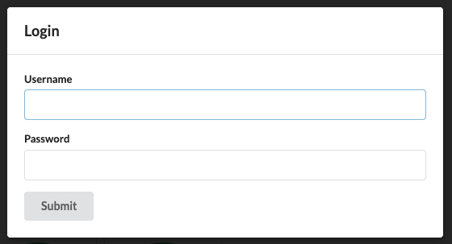
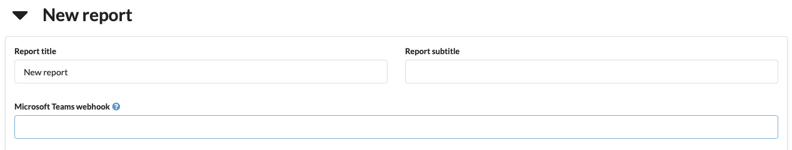
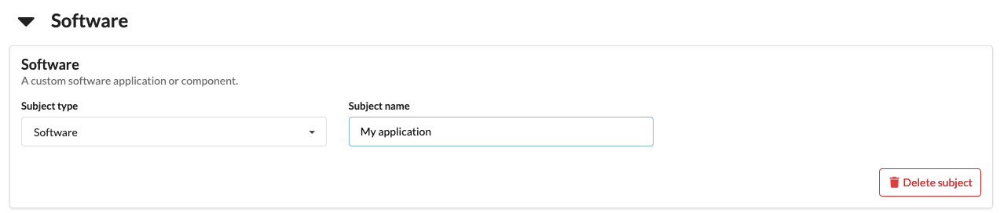
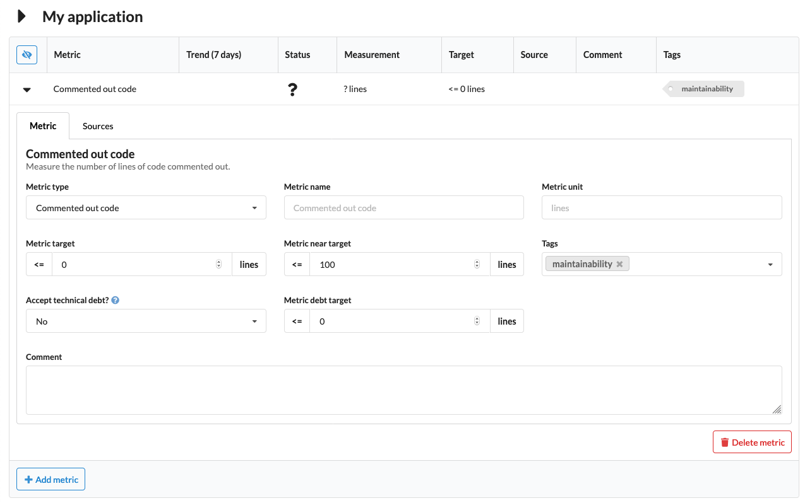
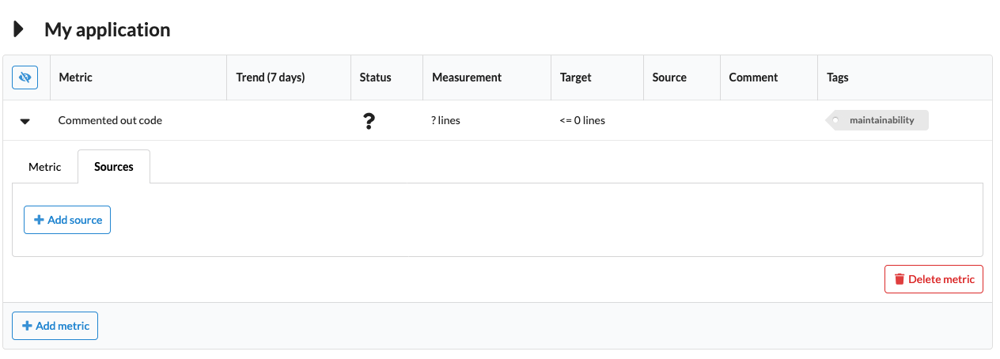
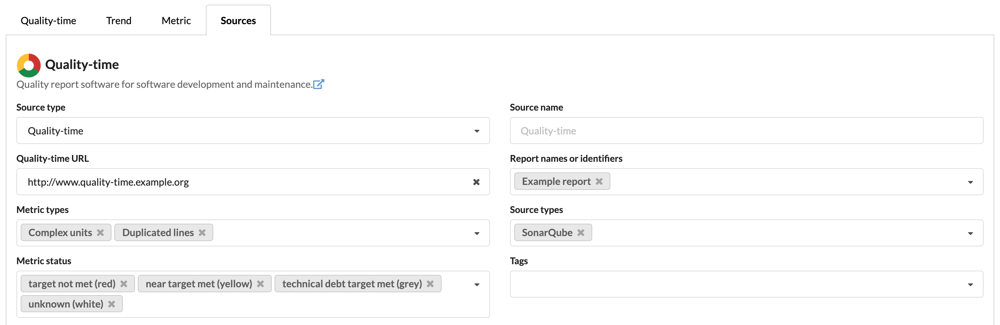
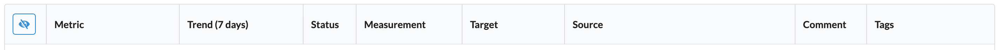

# *Quality-time* user manual

## Table of contents

- [Logging in and out](#logging-in-and-out)
- [Limiting editing rights](#limiting-editing-rights)
- [Configuring quality reports](#configuring-quality-reports)
  - [Configuring reports](#configuring-reports)
  - [Configuring subjects](#configuring-subjects)
  - [Configuring metrics](#configuring-metrics)
  - [Configuring sources](#configuring-sources)
- [Notes on specific metrics](#notes-on-specific-metrics)
  - [Metrics](#metrics)
  - [Unmerged branches](#unmerged-branches)
- [Notes on specific sources](#notes-on-specific-sources)
  - [GitLab](#gitlab)
  - [Jenkins, Jenkins test report, JaCoCo Jenkins plugin, and OWASP dependency check Jenkins plugin](#jenkins-jenkins-test-report-jacoco-jenkins-plugin-and-owasp-dependency-check-jenkins-plugin)
  - [Generic JSON for security warnings](#generic-json-for-security-warnings)
- [Customizing quality reports](#customizing-quality-reports)
  - [Customizing dashboards](#customizing-dashboards)
  - [Sorting metrics](#sorting-metrics)
  - [Filtering metrics by tag](#filtering-metrics-by-tag)
  - [Filtering metrics by status](#filtering-metrics-by-status)
  - [Hiding columns](#hiding-columns)
- [Exporting quality reports](#exporting-quality-reports)
  - [Manually](#manually)
  - [API](#api)
- [Notifications](#notifications)

---

## Logging in and out

Quality reports can be viewed without logging in, but to edit reports and metrics you need to be logged in. Click the "Login" button in the menu bar:


Enter your LDAP-credentials in the dialog:



> You can either use your canonical LDAP name as username or your LDAP user id. Please contact your system administrator if you don't know your LDAP credentials.

After hitting "Submit" you should be logged in. The menu bar shows your username. If you have a [Gravatar](https://gravatar.com), it will be shown next to your username.


Clicking "Logout" logs you out from *Quality-time*. Your user session expires after 24 hours and you need to log in again to be able to edit reports.

## Limiting editing rights

By default, any logged-in user can edit reports and metrics. However, editing rights can be limited to certain people. On the homepage, expand the reports overview title and add the usernames or email addresses of people who will be allowed to edit reports and metrics. 

If you forget to add yourself, your username will be added automatically. This means that you can't retract your own editing rights: add another user and ask them to remove your username or email address.

To restore the default situation where every logged in user can edit reports and metrics, simply remove all usernames and email addresses.

## Configuring quality reports

Each *Quality-time* instance can serve multiple quality reports. A quality report consists of one or more subjects - things such as software products, projects, and processes - that you want to measure the quality of. Each subject has one or more metrics that tell you something about the quality of the subject. For example, the number of failing test cases of an application, or the number of ready user story points for a Scrum team. To collect the measurement data, each metric has one or more sources that *Quality-time* will use to measure the metric.

> You need to be logged in to be able to edit quality reports.

### Configuring reports

#### Adding reports

To add a new report, be sure to be logged in and click the "Add report" button on the home page. This will create a new empty report. Click the report card in the dashboard to navigate to it.

#### Editing reports

To change the title or subtitle of a report, expand the report header and simply enter a new title and/or subtitle in their respective fields. For notifications, see the [Notifications](#notifications) section below.



#### Deleting reports

To delete a report expand the report header and click the "Delete report" button. The report and all its subjects is deleted.

> Be careful, there's no way to undo your action via the user interface.

### Configuring subjects

#### Adding subjects

Each quality report consists of "subjects". Subjects are the things being measured by *Quality-time*. A subject can be a software product or component, a software process, or whatever you like. To add a new subject, be sure you are logged in and are on a report page. Click the "Add subject" button to add a new subject. The subject is added to the report dashboard.

#### Editing subjects

To change the subject type and name expand the subject header if it's not already expanded. The subject type can be changed by means of the "Subject type" dropdown.



> Currently, changing the type of the subject does not affect what you can do with the subject.

To change the name of the subject, simply type the new name in the "Subject name" field and hit enter.

#### Deleting subjects

To delete a subject expand the subject header and click the "Delete subject" button. The subject and all its metrics is deleted.

> Be careful, there's no way to undo your action via the user interface.

### Configuring metrics

#### Adding metrics

To add a metric to a subject, hit the "Add metric" button.


*Quality-time* adds a metric to the report that you can next configure. It's immediately displayed in the metric table (and in the report dashboard) as white and with a question mark because *Quality-time* has no data on this metric yet.

#### Editing metrics

After you've added a metric, the metric is visible in the subject's metric table. You can change the metric configuration in the metric tab.



The first parameter is the "Metric type". The metric type determines what gets measured. When you change the metric type, the sources you can select in the "Sources" tab change accordingly. See the overview of [supported metrics and sources](METRICS_AND_SOURCES.md) for the list of supported metric types. By default, the name of the metric is equal to its type, "Duplicated lines" in the example below, but you can change the metric name using the "Metric name" field.

Metrics can have zero or more arbitrary "Tags". Most metric have a default tag, but you can remove it and/or add more if you like. For each tag, the report dashboard at the top of the page shows a summary of the metrics with that tag:


The "Metric scale" field determines what scale to use to measure the metric. All metrics currently support either the "Count" scale, or the "Percentage" scale, or both. In the example of the duplicated lines metric above, setting the metric scale to "Percentage" means that the percentage of lines that are duplicated is shown instead of the count of duplicated lines.

The "Metric direction" determines whether lower measurement values are considered to be better or worse. Usually, the default direction is correct. An example of a metric where you might want to change the direction is the "tests" metric. When used to measure the number of tests, more tests is better. But, when used to measure the number of failing tests, fewer is better.

The "Metric unit" derives its default value from the metric type. Override as needed.

The "Metric target" determines at what value a measurement is below or above target. In the example below only measurement values of 0 are on target. The "Metric near target" determines when the measurement value is sufficiently close to the target to no longer require immediate action. Metrics near their target are yellow.

If a metric doesn't meet the target value, but your team isn't able to fix the situation in the short run, you can accept the deviation as *technical debt*. Set the "Accept technical debt?" field to "Yes" and enter the value you're accepting for the time being in the "Metric debt target" field. If you want to pay off the debt before a certain date, this can be registered in the "Metric debt end date" field. The rationale for accepting technical debt can be entered in the "Comment" field.

#### Reordering metrics

To reorder metrics, expand the metric in the metric table and use the buttons on the lower left-hand side to move the metric one row higher or lower, or to the top or bottom of the table. The order is saved on the server. Users can temporarily override the default ordering of the metrics by clicking the column headers thus sorting by e.g. name or status.

#### Deleting metrics

To delete a metric, expand the metric in the metric table and click the "Delete metric" button. The metric and its sources are deleted.

> Be careful, there's no way to undo your action via the user interface.

### Configuring sources

#### Adding sources

To add a source to a metric, expand the metric in the metric table and then click the "Sources" tab. In the "Sources" tab, click the "Add source" button. This adds one of the sources that can support the metric type. See the overview of [supported metrics and sources](METRICS_AND_SOURCES.md) for the list of supported source types.



If you add multiple sources for one metric the measurement values of each source are combined to get one measurement value for the metric. Usually this means adding up the values, but for some metrics this doesn't make sense and the minimum or maximum value of the sources is used as the metric value.

#### Editing sources

After you've added a source, you can change the source type using the "Source type" drop-down menu. The available source types depend on the metric type. E.g. SonarQube supports the commented out code metric type, but GitLab does not so GitLab is not shown.

By default, the name of the source equals the source type but this can be overridden using the "Source name" field.

The parameters that sources need differ per source type. Most sources need a URL, and optionally take either a username and password or a token so that *Quality-time* can access the source. If a parameter is required, this is indicated with a red outline as shown below.


Source parameter (URL's, usernames, passwords, etc.) changes can be applied to different scopes: to just the source being edited or to multiple sources that have the same type and value as the one being edited. When applying the change to multiple sources, the user can change all sources that have the same type and value of a metric, of a subject, of a report, or of all reports.

#### Deleting sources

To delete a metric's source, expand the metric in the metric table, select the "Sources" tab and click the "Delete source" button. The source is deleted and no longer used to measure the metric.

> Be careful, there's no way to undo your action via the user interface.

## Notes on specific metrics

### Metrics

One special metric type is "Metrics". It counts the number of metrics in a quality report. This makes it possible to create 'meta'-reports that for example measure the number of security metrics that don't meet their target.

After adding *Quality-time* as a source to a "Metrics"-metric, one can configure which statuses to count and which metrics to consider by filtering on report names or identifiers, on metric types, on source types, and on tags.



Note that when the "Metrics" metric is itself part of the set of metrics it counts, a peculiar situation may occur: when you've configured the "Metrics" to count red metrics and its target is not met, the metric itself will become red and thus be counted as well. For example, if the target is at most five red metrics, and the number of red metrics increases from five to six, the "Metrics" value will go from five to seven. You can prevent this by making sure the "Metrics" metric is not in the set of counted metrics, e.g. by putting it in a different report and only count metrics in the other report(s).

### Unmerged branches

The unmerged branches metric reports on the number of branches that have not been merged back to the default branch in the version control system. Currently, GitLab and Azure DevOps can be configured as source for this metric.

The "master"-branch is the default branch in both GitLab and Azure DevOps. This means that a branch is considered unmerged if it has not been merged with master. If you want to use a different branch as default branch, you need to configure this in the source, see the documentation for [GitLab](https://docs.gitlab.com/ee/user/project/repository/branches/#default-branch) or [Azure DevOps](https://docs.microsoft.com/en-us/azure/devops/repos/git/manage-your-branches?view=azure-devops#change-your-default-branch).

To ignore branches that people are actively working on, use the "Number of days since last commit after which to consider branches inactive"-parameter.

### Merge requests

The merge requests metric reports the number of merge requests. Currently, GitLab and Azure DevOps can be configured as source for this metric.

In itself, the number of merge requests is not indicative of software quality. However, by setting the parameter "Minimum number of upvotes", the metric can report on merge requests that have fewer than the minimum number of upvotes. The parameter "Merge request state" can be used to exclude e.g. closed merge requests. The parameter "Target branches to include" can be used to further limit the merge requests to only count merge requests that target specific branches, e.g. the "develop" branch.

## Notes on specific sources

### GitLab

Some metric sources are documents in JSON, XML, CSV or HTML format. Examples include JUnit XML reports, Jacoco XML reports and Axe CSV reports. If such a document is stored in GitLab, *Quality-time* needs to use the GitLab API to retrieve the report. This means you need to provide the correct GitLab API URL to *Quality-time*.

There are two scenarios: the source is a build artifact of a GitLab CI pipeline, or the source is stored in a GitLab repository.

#### GitLab CI pipeline build artifact

When the metric source is a build artifact of a GitLab CI pipeline, use [URLs of the following format](https://docs.gitlab.com/ee/api/jobs.html#download-a-single-artifact-file-from-specific-tag-or-branch):

    https://<gitlab-server>/api/v4/projects/<project-id>/jobs/artifacts/<branch>/raw/<path>/<to>/<file-name>?job=<job-name>

The project id can be found under the [project's general settings](https://docs.gitlab.com/ee/user/project/settings/).

If the repository is private, you also need to enter an [personal access token](https://docs.gitlab.com/ee/user/profile/personal_access_tokens.html) with the scope "read_api" in the private token field.

#### GitLab repository file

When the metric source is a file stored in a GitLab repository, use [URLs of the following format](https://docs.gitlab.com/ee/api/repository_files.html#get-raw-file-from-repository):

    https://<gitlab-server>/api/v4/projects/<project-id>/repository/files/<file-path-with-slashes-%2F-encoded>/raw?ref=<branch>

The project id can be found under the [project's general settings](https://docs.gitlab.com/ee/user/project/settings/).

If the repository is private, you also need to enter an [personal access token](https://docs.gitlab.com/ee/user/profile/personal_access_tokens.html) with the scope "read_repository" in the private token field.

### Jenkins, Jenkins test report, JaCoCo Jenkins plugin, and OWASP dependency check Jenkins plugin

To authorize *Quality-time* for (non-public resources in) Jenkins, you can either use a username and password or a username and [API token](https://wiki.jenkins.io/display/JENKINS/Authenticating+scripted+clients). Note that, unlike other sources, when using the API token Jenkins also requires the username to which the token belongs.

### Generic JSON for security warnings

In some cases, there are security vulnerabilities not found by automated tools. Quality-time has the ability to parse security warnings from JSON files with a simple generic format.

The JSON format consists of an object with one key `vulnerabilities`. The value should be a list of, you guess it, vulnerabilities. Each vulnerability is an object with three keys: `title`, `description`, and `severity`. The title and description values should be strings. The severity is also a string and can be either `low`, `medium`, or `high`.

Example generic JSON file:

```json
{
    "vulnerabilities": [
        {
            "title": "ISO27001:2013 A9 Insufficient Access Control",
            "description": "The Application does not enforce Two-Factor Authentication and therefore not satisfy security best practices.",
            "severity": "high"
        },
        {
            "title": "Threat Model Finding: Uploading Malicious of Malicious files",
            "description": "An attacker can upload malicious files with low privileges can perform direct API calls and perform unwanted mutations or see unauthorized information.",
            "severity": "medium"
        }
    ]
}
```

## Customizing quality reports

Users can customize quality reports on an individual basis by changing the dashboard layout, by filtering metrics, and by filtering metric entities.

### Customizing dashboards

Both the reports dashboard on the *Quality-time* landing page and the dashboard of individual projects can be customized by dragging and dropping the cards. The dashboard layout is persisted in the database and thus shared with other users.

### Subject trend table

By default, subjects show the current measurement value of each metric, together with other details such as the target value, comments and tags. Subjects can also show multiple recent measurement values of each metric in the form of a trend table. Use the 'hamburger' menu on the top left-hand side of the metric table to switch between the 'details' and 'trend table' views.

### Sorting metrics

Metrics can be sorted by clicking on the table column headers. The sort order cycles between the default order, sorted ascending by the column click, and sorted descending by the column clicked.

### Filtering metrics by tag

In a report's dashboard, click on a tag card to show only metrics that have the selected tag. The selected tag turns blue to indicate it is filtered on. Click the selected tag again to turn off the filtering. Selecting multiple tags shows metrics that have at least one of the selected tags.

### Filtering metrics by status

Each metric table has a 'hamburger' menu on the top left-hand side that can be used to hide metrics that need no action.



### Hiding columns

Each metric table has a 'hamburger' menu on the top left-hand side that can be used to hide specific columns from the metric tables.

### Showing trend data

Each metric table has a 'hamburger' menu on the top left-hand side that can be used to switch between the default details view and a trend table view that shows the current and past measurements. Use the hamburger menu to show more or fewer dates and to configure the number of weeks between dates.

## PDF report export

*Quality-time* reports can be downloaded as PDF. To create PDFs, *Quality-time* has a rendering service included to convert the HTML report into PDF.

As *Quality-time* has to open the report in a (headless) browser and load all the metrics, creating the PDF can take some time. Especially for big reports.

### Manually

To manually download a PDF version of a report, navigate to the report and expand the report's title. Click the "Download report as PDF" button to create and download the PDF report.

The exported PDF report has the same metric table rows and columns hidden as in the user interface, and has the same metrics expanded as in the user interface. The exported PDF report also has the same date as the report visible in the user interface.

### API

If the PDF report needs to be downloaded programmatically, e.g. for inclusion in a release package, use the API: `http://www.quality-time.example.org/api/v3/report/<report_uuid>/pdf`. No authorization is needed for this API.

The `report_uuid` is the unique identifier that *Quality-time* assigns to a report. It can be found by navigating to a report in the browser and looking for the `report_uuid` in the address bar. For example, when the URL in the browser's address bar is `http://www.quality-time.example.org/f1d0e056-2440-43bd-b640-f6753ccf4496?hidden_columns=comment`, the part between the last slash and the question mark is the `report_uuid`.

To hide metrics that do not need any action, set the `hide_metrics_not_requiring_action` parameter to true, i.e. `http://www.quality-time.example.org/api/v3/report/<report_uuid>/pdf?hide_metrics_not_requiring_action=true`.

To hide columns from the report, set the `hidden_columns` parameter, for example `http://www.quality-time.example.org/api/v3/report/<report_uuid>/pdf?hidden_columns=target,comment`. Possible options are `trend`, `status`, `measurement`, `target`, `source`, `comment`, and `tags`.

To expand metrics and set the active tab of the metric detail information, use the `tabs` parameter, i.e. `http://www.quality-time.example.org/api/v3/report/<report_uuid>/pdf?tabs=<metric_uuid>:<tab_index>,<metric_uuid>:<tab_index>,...`. The metric UUID can be found by navigating to a report in the browser, expanding the metric, and looking for the `tabs` parameter in the address bar. For example, when the URL in the browser's address bar is `http://www.quality-time.example.org/1d0e056-2440-43bd-b640-f6753ccf4496?tabs=d4c0dea1-b072-417f-804e-6045544748db:0`, the part between the equal sign and the colon is the metric UUID of the expanded metric. The number after the colon is the number of the active tab, e.g. 0 is the metrics configuration tab, 1 is the source configuration tab, 2 is the trend graph, etc.

The use the subject trend table view instead of the default details view, use the `subject_trend_table` parameter and set it to true, for example `http://www.quality-time.example.org/api/v3/report/<report_uuid>/pdf?subject_trend_table=true`.

To change the number of dates and the time between dates shown in the trend table, use the `trend_table_nr_dates` and the `trend_table_interval` parameters. The number of dates should be an integer between 2 and 7. The interval should be an integer between 1 and 4 and is in weeks.

To export an older version of a report, add the `report_date` parameter with a date value in ISO-format (YYYY-MM-DD), for example `http://www.quality-time.example.org/api/v3/report/<report_uuid>/pdf?report_date=2020-09-01`.

## JSON report import/export

*Quality-time* provides functionality for importing and exporting reports in JSON format. This functionality can be used for backing up reports or for transferring reports from one *Quality-time* instance to another one. Currently this functionality is only available via the api, with one endpoint for importing and one for exporting the JSON reports.

A *Quality-time* report JSON contains the configuration of the report, with all it's subjects, metrics and sources. It does not contain any actual measurements. 
The credentials of configured sources will be encrypted to prevent the loss of sensitive data.

### Export API

The exporting endpoint is available under `http://www.quality-time.example.org/api/v3/report/<report-uuid>/json?public_key=<public-key>`. The public key argument is optional, if no public key is provided, the public key of the exporting *Quality-time* instance is used for encrypting the source credentials. If the report needs to be imported in a different *Quality-time* instance, the public key of that instance should be provided. It can be opbtained at `www.quality-time.example.org/public_key`. The exported JSON report can only be imported into the *Quality-time* who's public key has been used for the credential encryption during the export.

### Import API

Exported reports can be imported back into *Quality-time*. The endpoint for this is `http://www.quality-time.example.org/api/v3/report/import`. The import accepts JSON content only.

Only exports that have been exported using the public key of the imported *Quality-time* instance can be imported. The Source credentials will be decrypted on import and the sources should be ready to collect measurements automatically.

On import, all UUID's contained in the report (UUID's of the report, subjects, metrics and sources) will be replaced to prevent conflicts if the report already exists.

## Notifications

*Quality-time* can send notifications about metrics that change status to Microsoft Teams channels. To enable notifications for a report, expand the report header and paste a [Microsoft Teams webhook](https://docs.microsoft.com/en-us/microsoftteams/platform/webhooks-and-connectors/how-to/add-incoming-webhook).

If a webhook has been configured, *Quality-time* will check for changes in the status of metrics every minute. As soon as one or more metrics in the report change status, a notification will be sent to the Microsoft Teams channel configured by the webhook.

To prevent too many notifications, it's possible to make *Quality-time* wait before sending a notification. If more notifications occur during the wait period, they will be bundled with the first notification and sent together at the end of the wait period. Note that if you change the notification configuration, e.g. change a Microsoft Teams web hook, earlier notifications that haven't been sent yet, will still be sent using the old configuration.
