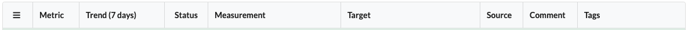

# *Quality-time* user manual

## Table of contents

- [Logging in and out](#logging-in-and-out)
- [Configuring quality reports](#configuring-quality-reports)
- [Notes on specific metrics](#notes-on-specific-metrics)
- [Customizing quality reports](#customizing-quality-reports)
- [Exporting quality reports](#exporting-quality-reports)

## Logging in and out

Quality reports can be viewed without logging in, but to edit reports and metrics you need to be logged in. Click the "Login" button in the menu bar:

Enter your LDAP-credentials in the dialog:

> You can either use your canonical LDAP name as username or your LDAP user id. Please contact your system administrator if you don't know your LDAP credentials.

After hitting "Submit" you should be logged in. The menu bar shows your username.

Clicking "Logout" logs you out from *Quality-time*. Your user session expires after 24 hours and you need to log in again to be able to edit reports.

## Configuring quality reports

Each *Quality-time* instance can serve multiple quality reports. A quality report consists of one or more subjects - things such as software products, projects, and processes - that you want to measure the quality of. Each subject has one or more metrics that tell you something about the quality of the subject. For example, the number of failing test cases of an application or the number of ready user story points for a Scrum team. To collect the measurement data, each metric has one ore more sources that *Quality-time* will use to measure the metric.

> You need to be logged in to be able to edit quality reports.

### Adding reports

To add a new report, be sure to be logged in and click the "Add report" button on the home page. This will create a new empty report. Click the report card in the dashboard to navigate to it.

### Editing reports

To change the title or subtitle of a report, expand the report header and simply enter a new title and/or subtitle in their respective fields.

### Deleting reports

To delete a report expand the report header and click the "Delete report" button. The report and all its subjects is deleted.

> Be careful, there's no way to undo your action via the user interface.

### Adding subjects

Each quality report consists of "subjects". Subjects are the things being measured by *Quality-time*. A subject can be a software product or component, a software process, or whatever you like. To add a new subject, be sure you are logged in and are on a report page. Click the "Add subject" button to add a new subject. The subject is added to the report dashboard.

### Editing subjects

To change the subject type and name expand the subject header if it's not already expanded. The subject type can be changed by means of the "Subject type" dropdown.

> Currently, changing the type of the subject does not affect what you can do with the subject.

To change the name of the subject, simply type the new name in the "Subject name" field and hit enter.

### Deleting subjects

To delete a subject expand the subject header and click the "Delete subject" button. The subject and all its metrics is deleted.

> Be careful, there's no way to undo your action via the user interface.

### Adding metrics

To add a metric to a subject, hit the "Add metric" button.

*Quality-time* adds a metric to the report that you can next configure. It's immediately displayed in the metric table (and in the report dashboard) as white and with a question mark because *Quality-time* has no data on this metric yet.

### Editing metrics

After you've added a metric, the metric is visible in the subject's metric table. You can change the metric configuration in the metric tab.

* The first parameter is the "Metric type". The metric type determines what gets measured. When you change the metric type, the sources you can select in the "Sources" tab change accordingly. By default the name of the metric is equal to its type, in the example below "Duplicated lines", but you can change the metric name using the "Metric name" field.
* Metrics can have zero or more arbitrary "Tags". Most metric have a default tag, but you can remove it and/or add more if you like. For each tag, the report dashboard at the top of the page shows a summary of the metrics with that tag:

  

* The "Metric scale" field determines what scale to use to measure the metric. All metrics currently support either the "Count" scale or the "Percentage" scale, or both. In the example of the duplicated lines metric above, setting the metric scale to "Percentage" means that the percentage of lines that are duplicated is shown instead of the count of duplicated lines.
* The "Metric direction" determines whether lower measurement values are considered to be better or worse. Usually, the default direction is correct. An example of a metric where you might want to changes the direction is the "tests" metric. When used to measure the number of tests, more tests is better. But when used to measure the number of failing tests, fewer is better.
* The "Metric unit" derives its default value from the metric type. Override as needed.
* The "Metric target" determines at what value a measurement is below or above target. In the example below only measurement values of 0 are on target. The "Metric near target" determines when the measurement value is sufficiently close to the target to no longer require immediate action. Metrics near their target are yellow.
* If a metric doesn't meet the target value, but your team isn't able to fix the situation in the short run, you can accept the deviation as *technical debt*. Set the "Accept technical debt?" field to "Yes" and enter the value you're accepting for the time being in the "Metric debt target" field. If you want to pay off the debt before a certain date, this can be registered in the "Metric debt end date" field. The rationale for accepting technical debt can be entered in the "Comment" field.

### Reordering metrics

To reorder metrics, expand the metric in the metric table and use the buttons on the lower left hand side to move the metric one row higher or lower, or to the top or bottom of the table. The order is saved on the server. Users can temporarily override the default ordering of the metrics by clicking the column headers thus sorting by e.g. name or status.

### Deleting metrics

To delete a metric, expand the metric in the metric table and click the "Delete metric" button. The metric and its sources are deleted.

> Be careful, there's no way to undo your action via the user interface.

### Adding sources

To add a source to a metric, expand the metric in the metric table and then click the "Sources" tab. In the "Sources" tab, click the "Add source" button. This adds one of the sources that can support the metric type.

If you add multiple sources for one metric the measurement values of each source are combined to get one measurement value for the metric. Usually this means adding up the values, but for some metrics this doesn't make sense and the minimum or maximum value of the sources is used as the metric value.

### Editing sources

After you've added a source, you can change the source type using the "Source type" drop-down menu. The available source types depend on the metric type. E.g. SonarQube supports the commented out code metric type, but GitLab does not so GitLab is not shown.

By default, the name of the source equals the source type but this can overridden using the "Source name" field.

The parameters that sources need differ per source type. Most sources need a URL, and optionally take either a username and password or a token so that *Quality-time* can access the source. If a parameter is required, this is indicated with a red outline as shown below.

### Deleting sources

To delete a metric's source, expand the metric in the metric table, select the "Sources" tab and click the "Delete source" button. The source is deleted and no longer used to measure the metric.

> Be careful, there's no way to undo your action via the user interface.

## Notes on specific metrics

### Metrics

One special metric type is "Metrics". It counts the number of metrics in a quality report. This makes it possible to create 'meta'-reports that for example measure the number of security metrics that don't meet their target.

After adding Quality-time as a source to a "Metrics"-metric, one can configure which statuses to count and which metrics to consider by filtering on report names or identifiers, on metric types, on source types, and on tags.

### Unmerged branches

The unmerged branches metric reports on the number of branches that have not been merged back to the default branch in the version control system. Currently, GitLab and Azure DevOps can be configured as source for this metric.

The "master"-branch is the default branch in both GitLab and Azure DevOps. This means that a branch is considered unmerged if it has not been merged with master. If you want to use a different branch as default branch, you need to configure this in the source, see the documentation for [GitLab](https://docs.gitlab.com/ee/user/project/repository/branches/#default-branch) or [Azure DevOps](https://docs.microsoft.com/en-us/azure/devops/repos/git/manage-your-branches?view=azure-devops#change-your-default-branch).

To ignore branches that people are actively working on, use the "Number of days since last commit after which to consider branches inactive"-parameter.

## Customizing quality reports

Users can customize quality reports on an individual basis by changing the dashboard layout, by filtering metrics, and by filtering metric entities.

### Customizing dashboards

Both the reports dashboard on the Quality-time landing page as well as the dashboard of individual projects can be customized by dragging and dropping the cards. The dashboard layout is persisted in the local storage of the user's browser. There is currently no mechanism to share dashboard layouts with other users.

### Filtering metrics by tag

In a report's dashboard, click on a tag card to show only metrics that have the selected tag. The selected tag turns blue to indicate it is filtered on. Click the selected tag again to turn off the filtering. Selecting multiple tags shows metrics that have at least one of the selected tags.

### Filtering metrics by status

Each metric table has a button on the top left hand side that can clicked to hide metrics that need to action. Click it again to undo the filtering.

## Exporting quality reports

Quality-time reports can be downloaded as PDF. To create PDFs, Quality-time has a rendering service included to convert the HTML report into PDF.

### Manually

To manually download a PDF version of a report, navigate to the report and expand the report's title. Click the "Download report as PDF" button to create and download the PDF report.

### API

If the PDF report needs to be downloaded programmatically, e.g. for inclusion in a release package, use the API: `http://www.quality-time.example.org/api/v1/report/<report_uuid>/pdf`. No authorization is needed for this API.